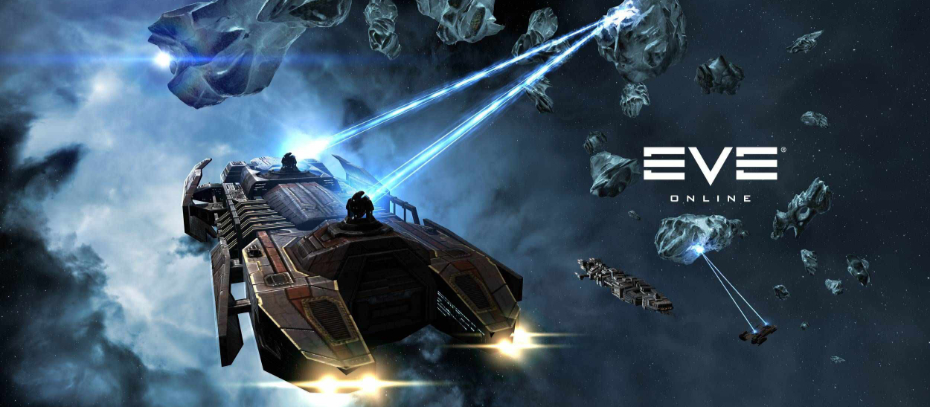

# ᵔᴥᵔ EVE Online MacOS Support Miner - eveOSXminer
     
> A handy MacOS EVE Online mining operations support tool for automating some of the mining tasks

---

# Mining in EVE Online

This is what started it all :) Wanted to play EVE Online and put some time into not fully roleplay but at least giving it some thought. I already knew from the get-go that i wanted to create a mining and perhaps salvage operation and thus this became a thing.

As the days went by and i was mining a lot more and having a blast. But as always, when any captain's sitting there in the uncomftable, worn down cockpit chair of his mining barge or large hauler. Flipping those same switches on the console or giving the same commands over and over on the nav comm - it's getting to you... One starts to wonder: "How can i jury rig this to do it for me so i have time to read Ore daily while on the head".

And here we are - Thus came these mining support tools to life :) Right ?

# Mining Operation - Support Tools

So far i've just started this "project" idea op, there are nothing ready yet. It's a concept idea and so are the scripts for now. It's all in my head ! I have written down what i want to look at and what i have been thinking about.

- Tool to look for an astroid with X km and target lock it then engage mining drones
- Tool to prepare ship for closing shop time, ie. recalling drones, disabling forman buffs, announcing closing time to fleet
- Tool to report astroids (number, sizes, types) via text to speech/save to ledger file etc
- Tool to report mining yield/to ledger
- Tool to watch radar contact (AIS), alerting of danger/enemy ships
- Tool to relocate closer to an astroid (within X km)
- Tool to remotely enable/disable forman optimisation buffs etc via chat commands so fleet can ask for them or shut it down

And other tools like this, again i'm not aiming to automate things fully i want to make something that i would imagine a real space mining cowboy would have at his disposal :)

# Setting up the EVE Online interface

There will most likely have to be some sort of static setup of the UI so the tools will know where to look for things on the screen. This will also be something that is based on screen resolution i guess. How this will work so far, i'm not sure about. But let's figure it out. Also i want to do all of this without any other external software requirements. So it has to be kept simple.

# EVE Online - AFK Mining ( Bots )

I wanted to give a short note on AFK mining and EVE Online. I don't like it i don't condone it. Mining is a career path in the game and should be respected as such. Not a ISK money making machine. Yes you harvest resources to make money selling on the market but that is the point - You do it, not some bot ! It's ment to be fun and also for some it's a roleplay and all of those who just afk-bot farm entire astroid belts are destroying the fun for us!

These tools are ment to help you out on your daily job, as a miner we work hard and play hard :) So a little automation is in order - Just like real life! But please note that CPP and EVE Online do not allow any third party applications or scripting to be done to their game or to change the way it was intented to be played. So even if these tools are only ment to be support, they are in violation of their rules. So please only use them if you know the consequeces.

Please refere to [EVE Online Community thord party polices](https://community.eveonline.com/support/policies/third-party-policies-en/)

# Developing and Contributing

I do like it when others show their knowlagde and ingenuity solving problems. This project is however mostly ment to be my own small private thing. But i think that it could be so much more ? If you wan to help out or just give some ideas please do so! Everything will need to be approved so use pull requests as always.

Please refere to the [Contribution Document](https://github.com/kawaiipantsu/eveOSXminer/blob/master/CONTRIBUTING.md) for full info on how to get involved and get things merged.

# Licensing

See [LICENSE](https://github.com/kawaiipantsu/eveOSXminer/blob/master/LICENSE) file. eveOSCminer is licensed by KawaiiPantsu under the GNU license. KawaiiPantsu can be contacted via github.

